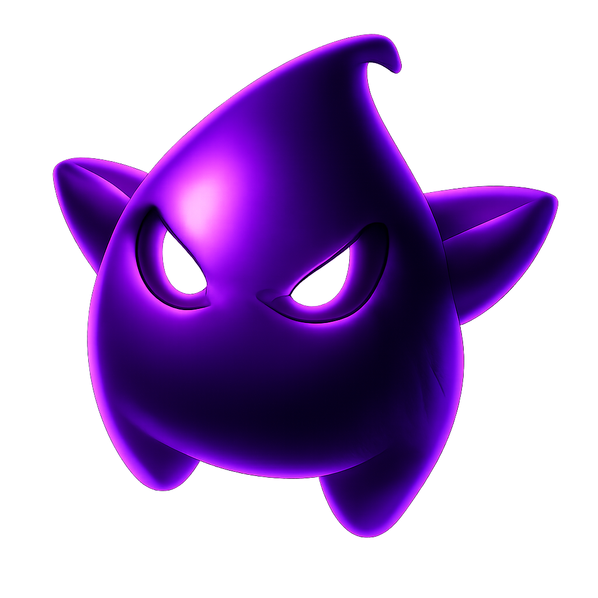

<div align="center">
  
  <br>
  <br>
  <pre>
██████╗  █████╗ ██████╗ ██╗  ██╗ ██████╗ ██████╗ ██████╗ ███████╗
██╔══██╗██╔══██╗██╔══██╗██║ ██╔╝██╔════╝██╔═══██╗██╔══██╗██╔════╝
██║  ██║███████║██████╔╝█████╔╝ ██║     ██║   ██║██████╔╝█████╗  
██║  ██║██╔══██║██╔══██╗██╔═██╗ ██║     ██║   ██║██╔══██╗██╔══╝  
██████╔╝██║  ██║██║  ██║██║  ██╗╚██████╗╚██████╔╝██║  ██║███████╗
╚═════╝ ╚═╝  ╚═╝╚═╝  ╚═╝╚═╝  ╚═╝ ╚═════╝ ╚═════╝ ╚═╝  ╚═╝╚══════╝
  </pre>
  <h3>System Orchestration & Compatibility Layer</h3>
  <p>
    <b>High-Performance. Memory-Safe. Cyberpunk Aesthetics.</b>
  </p>
  
  <p>
    
    
    
    
    
  </p>

  <p>
    <a href="#features">Features</a> •
    <a href="#architecture">Architecture</a> •
    <a href="#compilation">Compilation</a> •
    <a href="#disclaimer">Disclaimer</a>
  </p>
</div>

---

<br>

> [!CAUTION]
> **LEGAL DISCLAIMER & ZERO LIABILITY**
>
> 1.  **Independent Research**: **DarkCore Manager** is an independent project created solely for educational purposes, demonstrating advanced Rust UI patterns and process orchestration.
> 2.  **No Affiliation**: This software is **NOT** affiliated with, endorsed by, or connected to Valve Corporation, Steam, GreenLuma, Steamless, or Morrenus.
> ### 3. **No Proprietary Data**: This tool **does NOT** contain, distribute, or host any copyrighted game binaries or proprietary code. It operates strictly by managing local configuration text files (e.g., `AppList/*.txt`).
> 4.  **User Responsibility**: The user assumes full responsibility for compliance with all applicable Terms of Service and local laws. The author assumes **NO LIABILITY** for bans, data loss, or system instability.

<br>

## 🚀 System Overview

**DarkCore Manager** redefines the compatibility layer experience. Abandoning legacy Python scripts, it introduces a **Rust-native architecture** designed for speed, safety, and visual immersion.

Acting as a sophisticated **Middleware Orchestrator**, it automates the complex interplay between Steam, file systems, and injection tools, wrapping it all in a "God-Tier" interface.

## 🧠 Architecture: Under the Hood

Unlike basic launchers, DarkCore operates as a state-aware system supervisor:

*   **Context Switching**: Generates context-aware configurations to guide injection targets.
*   **Deterministic Loading**: Dynamically builds and sorts the `AppList` directory structure (`0.txt`, `1.txt`...), ensuring deterministic loading of entitlements.
*   **Depot Authorization**: Parses Lua scripts to surgically inject key-values into Steam's `config/config.vdf`, enabling authorized interaction with encrypted depots.
*   **Manifest Deployment**: Extracts official signed Steam Manifests (`.manifest`) directly into the `depotcache` directory, allowing compliant file verification.
*   **Process Orchestration**: Manages the lifecycle of child processes via native Win32 calls.

**It doesn't just run commands. It manages the environment.**

## 🗝️ System Attributes: Core Modules
To achieve seamless interoperability, three systems must work in unison. DarkCore orchestrates them all:

### 1. 🔓 Steamless (Static Analysis & Unpacking)
*   **Role**: **Executable Unpacker**.
*   **Function**: Automated handling of the "SteamStub" wrapper. It preserves the integrity of the original binary while preparing it for an offline or sandboxed execution environment.
*   **DarkCore Integration**: Fully automated via the "Steamless" tab. Handles backup (`.bak`), unpacking, and replacement with 100% safety.

### 2. 🔑 GreenLuma (Injection Interface)
*   **Role**: **Client Debug Parameter Override**.
*   **Function**: Leveraging the Steam Client's "Family Sharing" protocols, it allows for the loading of specific AppIDs into the local context for testing and library management purposes.
*   **DarkCore Integration**: Feeds the `AppList` to the injector to initialize the UI state.

### 3. 📡 Morrenus Integration (Depot Synchronization)
*   **Role**: **Manifest & Key Aggregation**.
*   **Function**: Facilitates the retrieval of **Signed Manifests** and **Depot Keys** necessary for the client to validate and download content from the CDN.
*   **DarkCore Integration**: Automates the retrieval of Lua scripts and Manifests, ensuring correct `config.vdf` and `depotcache` alignment.

### 4. 🧠 TITAN Module (Runtime Persistence Layer) - *NEW!*
*   **Role**: **Steamworks API Emulation**.
*   **Function**: A custom `dll` proxy that intercepts and handles `ISteamRemoteStorage` and `ISteamUserStats` calls locally. This ensures application stability when the client cannot reach the backend.
*   **Capabilities**:
    *   **💾 Local Storage Virtualization**: Redirects save game I/O to a sandboxed local directory, decoupling it from the Cloud.
    *   **☁️ State Harmonization**: Patches `localconfig.vdf` and manages `remotecache.vdf` to ensure the Client UI reflects a "Healthy/Updated" state, eliminating synchronization errors.
    *   **🏆 Offline Achievement Tracking**: Persists unlocked achievements to a local `stats.txt` database, preserving user progress across sessions without upstream server dependency.


---

## ✨ Feature Matrix

### 🟢 Hybrid API Core
DarkCore adapts to your environment in real-time.

| Mode          | Status       | Functionality                                                                                                        |
| :------------ | :----------- | :------------------------------------------------------------------------------------------------------------------- |
| **Valid Key** | **UNLOCKED** | Full Morrenus API integration. Precise AppID resolution. Manifest downloads enabled. VDF Injection active.           |
| **No Key**    | **FALLBACK** | **Silent Fallback to Public Steam Store**. Instant Search & DLC listings via public API. Perfect for Family Sharing. |

> [!NOTE]
> **External Resources**: GreenLuma, Steamless, and API Keys are third-party resources. You must acquire them independently.

### 🛡️ Smart "Strict Check"
When a valid key is detected, DarkCore enforces **Strict Validation**, preventing the installation of broken or unsupported AppIDs. If it's not in the database, it doesn't touch your disk.

### ⚡ Technical Highlights
*   **Rust Native**: Compiled to machine code. Zero interpreter overhead. 15.1MB standalone binary.
*   **Cyberpunk Interface**: Built with `egui` (Immediate Mode GUI). High-FPS rendering, custom styling, responsive layout.
*   **Limit Bypass**: Proprietary **Profile System** allows unlimited libraries by hot-swapping `AppList` configurations.
*   **Steamless Automation**: Integrated GUI for `Steamless CLI` with **Auto-Backup** (`.bak`), **Auto-Rename**, and **Smart Detection**.

---

## 🛠️ Compilation Source

We believe in transparency. Build it yourself.

### Prerequisites
*   [**Rust Toolchain (rustup)**](https://rustup.rs/)
*   **Git** & **Windows SDK**

### Build Sequence

1.  **Clone Repository**
    ```powershell
    git clone https://github.com/hkmodd/DarkCore-Manager.git
    cd DarkCore-Manager
    ```

2.  **Asset Injection (Optional)**
    *   Place your `icon.ico` in the `manager/` directory. The build system will fuse it into the executable.

3.  **Compile System**
    ```powershell
    cargo build --release
    ```
    *This command compiles the entire workspace:*
    *   **Manager**: `target/release/darkcore-manager.exe` (The UI Application)
    *   **Titan Hook**: `target/release/titan_hook.dll` (The Stealth Layer)

    > [!TIP]
    > Ensure both files are in the same directory for deployment to work correctly.

---

## ⚙️ Operational Protocol

### 1. Environment Mapping (Initialization)
Upon first boot, the core system requires mapping to your local ecosystem. Navigate to the **SETTINGS** tab to initialize the environment:

*   **Steam Root**: The directory housing `Steam.exe` (e.g., `C:\Program Files (x86)\Steam`).
*   **GreenLuma Artifact**: The folder containing the *GreenLuma 2024* binary (`DLLInjector.exe`).
*   **Steamless Binary**: Path to `Steamless.CLI.exe`. This is **critical** for the "Unpacker" module to function correctly on protected executables.
*   **Morrenus API Key**: (Optional) Input your private key to unlock the "Intelligence Module" (Manifests & Decryption Keys).
    *   *Note: Without this key, the system defaults to **Fallback Mode** (Public Steam Store API), limiting capabilities to Library Management only.*

### 2. The Execution Cycle
DarkCore streamlines the deployment process into a deterministic linear workflow:

1.  **Query**: Navigate to **SEARCH**, input a specific AppID or Game Name. The system actively queries the selected database.
2.  **Selection**: Choose your target application. The interface will populate available DLC content dynamically.
3.  **Titan Activation (Crucial)**: For specific titles requiring local emulation (e.g., *Spyro Reignited*), click the **ACTIVATE TITAN** button.
    *   *Action*: Deploys the `titan_hook.dll` proxy and performs "State Harmonization" on the Steam Cloud config.
4.  **Engage**: Click **PLAY / INJECT**.
    *   *Sequence Initiated*: `Terminate Steam` -> `Generate AppList` -> `Inject Configs` -> `Restart Steam` -> `Inject GreenLuma`.

> [!IMPORTANT]
> **Process Hygiene**: Always ensure Steam is **fully terminated** before initiating a new injection cycle to prevent file locking or memory offset conflicts.

---

<div align="center">
  
  <br>
  <sub>"Wake up, Samurai. We have a compiled language to burn."</sub>
</div>
